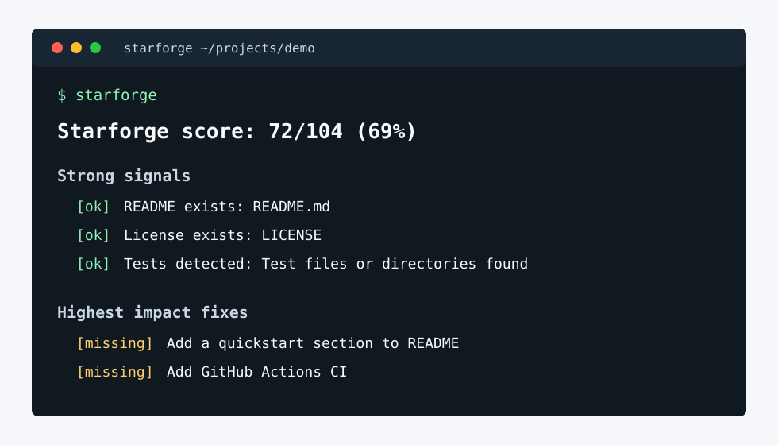

# Starforge

Audit a repository for the signals that make people trust, use, and star open source projects.



Starforge is a zero-dependency Python CLI that scores a repo and prints a concrete checklist for improving its GitHub presence: README quality, install instructions, examples, tests, CI, license, contribution docs, releases, and repo metadata.

## Why this exists

Most repos do not lose stars because the code is bad. They lose them because a visitor cannot answer these questions in under a minute:

- What does this do?
- Can I install or try it quickly?
- Is it maintained?
- Can I trust it in my project?
- What should I do next?

Starforge turns those questions into a fast local audit.

## Install

```bash
pipx install starforge
```

During local development:

```bash
python -m pip install -e .
```

## Usage

Audit the current directory:

```bash
starforge
```

Audit another repository:

```bash
starforge /path/to/repo
```

Print JSON for automation:

```bash
starforge --json
```

## Example

```text
Starforge score: 72/100

Strong signals
  [ok] README exists
  [ok] License exists
  [ok] Tests detected

Highest impact fixes
  [missing] Add a quickstart section to README
  [missing] Add screenshots, demo GIFs, or terminal output examples
  [missing] Add GitHub Actions CI
```

## Checks

Starforge currently checks for:

- README presence and useful sections
- Install, usage, quickstart, and examples
- Visual proof such as screenshots, GIFs, SVGs, or terminal output
- License
- Tests
- CI
- Contribution and code of conduct docs
- Security policy
- Changelog or releases notes
- Package metadata
- GitHub issue and pull request templates

## Development

```bash
python -m pytest
python -m starforge --json .
```

## Launch Checklist

Before publishing this repo:

1. Create a crisp GitHub description: `Audit your repo for the signals that earn trust and stars.`
2. Add topics: `github`, `open-source`, `cli`, `readme`, `repository-audit`, `maintainer-tools`.
3. Pin a short demo GIF or terminal screenshot at the top of the README.
4. Publish a `v0.1.0` release with a screenshot and example output.
5. Post the launch to communities where maintainers hang out, with a real before/after repo audit.

## License

MIT
